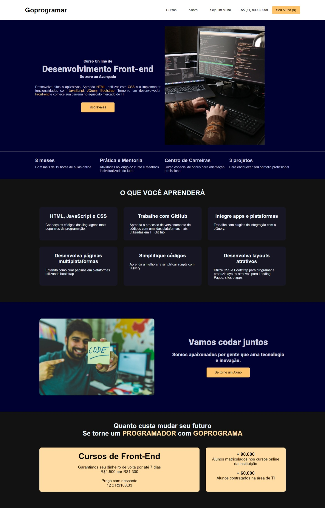

<h1>
   
</h1>

## 👩🏽‍💻 Sobre o Projeto Goprogramar 

 Site fictício

 No projeto **Curso** de **Front-end** do **GOPROGRAMA** eu trabalhei no desenvolvimento completo do **HTML** , **CSS** do site. Utilizei todo meu conhecimento inicial de **HTML** e **CSS** do curso Origamida.

 Este projeto é pessoal e não foi desenvolvido no curso.

---
## 👩🏽‍💻 Tecnologia Utilizada

O projeto foi desenvolvido com as seguintes tecnologias

- HTML

- CSS

---
## 👩🏽‍💻 Acesse o projeto

<h3>
     <a href="https://github.com/lyrisnunes/Goprogramar-Curso-EAD.git">- Veja o projeto</a>
</h3>

---
Desenvolvido por Lyris Nunes